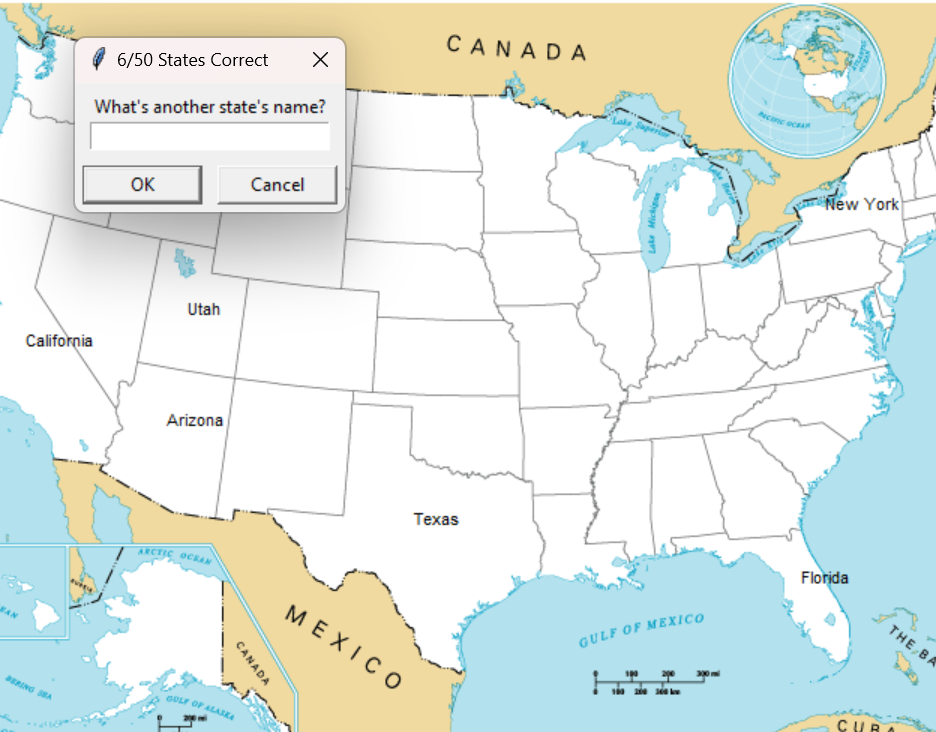

# Guess-the-State
Easy and fun way to memorize the states in the USA. Created in Python.

## How to use
1. Download the repository
2. Run the main.py file
3. Type the name of the state you want to guess
4. If you want to exit the game, type "exit"

